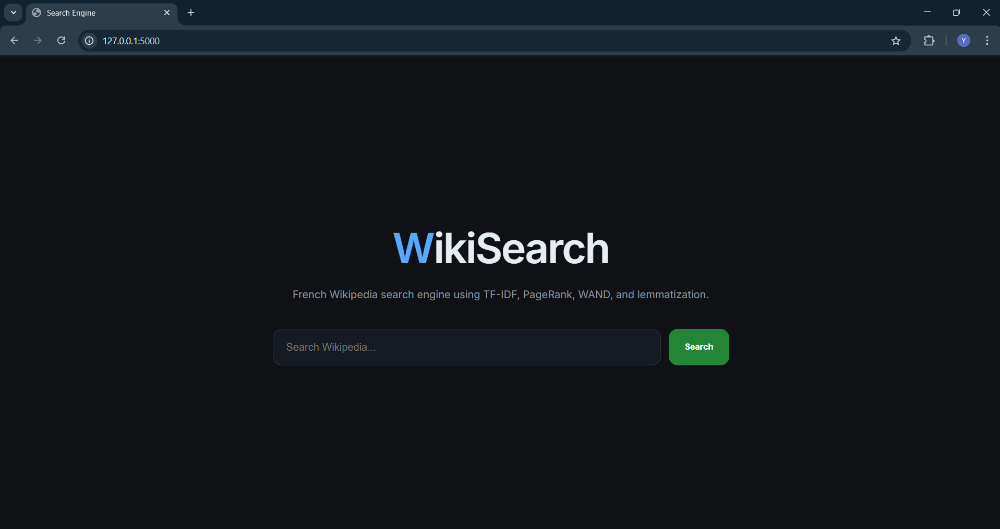
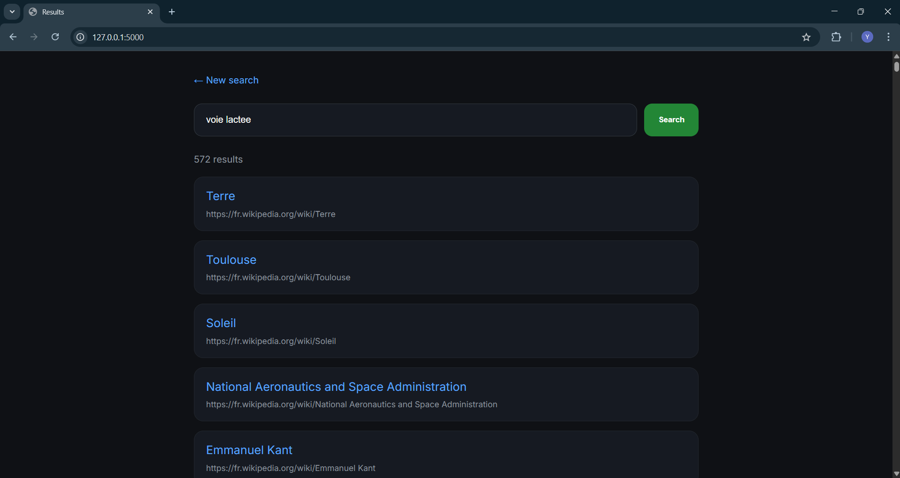
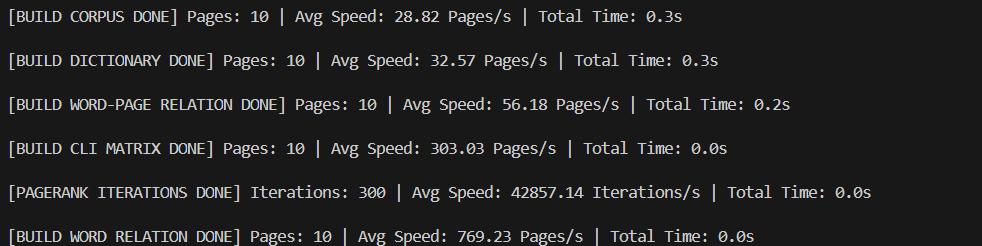
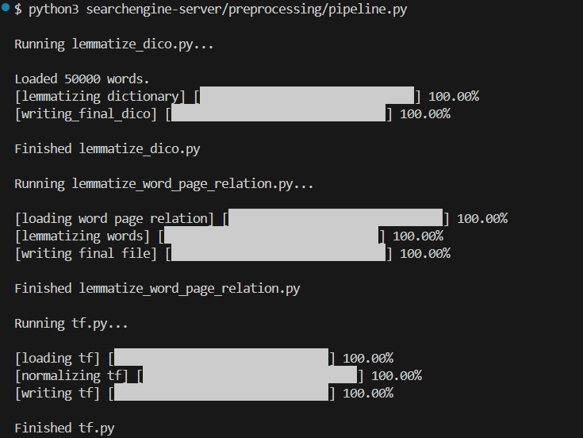
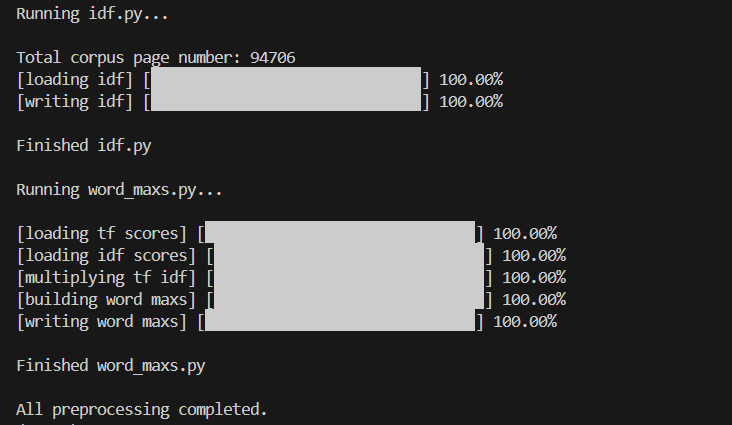

# WikiSearch Engine 🔎

<p align="center">
  
</p>

<p align="center">
  A custom Wikipedia Search Engine built with Java and Python
</p>

<p align="center">
  TF-IDF • PageRank • WAND Algorithm • Flask
</p>

---

# 📖 Overview

This project is a custom Wikipedia search engine built with Java and Python.

The engine parses Wikipedia XML dumps, preprocesses and indexes the data,
computes ranking scores using TF-IDF, PageRank, and the WAND algorithm,
then serves ranked search results through a Flask web application.

The project is divided into 3 major stages:

1. Java preprocessing
2. Python preprocessing pipeline
3. Flask search server

The goal of this project was to better understand:

- Information Retrieval
- Search ranking algorithms
- TF-IDF
- PageRank
- WAND algorithm
- Text preprocessing
- Wikipedia XML parsing
- Backend search systems
- Indexing systems
- Query optimization

---

# 💡 Project Idea

This project was designed to reproduce some important concepts used in modern search engines such as:

- XML parsing
- Corpus construction
- Inverted indexing
- TF-IDF ranking
- PageRank
- WAND query processing
- Lemmatization
- Query ranking
- Ranked retrieval systems
- Web search interfaces

---

# 🧠 Project Pipeline

The application processes a Wikipedia XML dump in multiple stages:

## 1️⃣ Java preprocessing

- Parsing Wikipedia pages
- Extracting article content
- Building the corpus
- Computing PageRank
- Generating intermediate indexing files

---

## 2️⃣ Python preprocessing

- TF computation
- IDF computation
- Lemmatization
- Word statistics generation
- Search optimization data preparation

---

## 3️⃣ Python server

- Runs the search engine
- Serves the Flask web interface
- Handles search queries
- Uses the WAND algorithm for efficient ranked retrieval
- Displays ranked search results

---

# 🖼️ Screenshots

## Search Engine Home

<p align="center">
  
</p>

---

## Search Results

<p align="center">
  
</p>

---

## Java Preprocessing Execution

<p align="center">
  
</p>

---

## Python Pipeline Execution

<p align="center">
  
</p>
<p align="center">
  
</p>

---

# 📂 Project Structure

```bash
.
├── java-preprocessing
│   └── src
│       └── com
│           └── searchengine
│               ├── Main.java
│               ├── BuildCorpus.java
│               ├── Pagerank.java
│               ├── BuildCLI.java
│               ├── experiments
│               └── utils
│
├── resources
│   ├── raw
│   ├── java-processed
│   └── python-processed
│
├── searchengine-server
│   ├── preprocessing
│   │   ├── pipeline.py
│   │   ├── tf.py
│   │   ├── idf.py
│   │   ├── word_maxs.py
│   │   └── lemmatize_word_page_relation.py
│   │
│   ├── server
│   │   ├── app.py
│   │   ├── templates
│   │   └── static
│   │
│   ├── experiments
│   │   └── wand.py
│   │
│   └── requirements.txt
│
└── README.md
```

---

# ⚙️ Technologies Used

- Java
- Python3
- Flask
- HTML/CSS
- Wikipedia XML Dumps

---

# 🔍 Features

- Wikipedia XML parsing
- TF-IDF ranking
- PageRank implementation
- WAND algorithm integration
- Lemmatization support
- Flask web interface
- Multi-stage preprocessing pipeline
- Custom indexing system
- Ranked document retrieval
- Query optimization

---

# 🔄 Search Engine Workflow

```text
Wikipedia XML Dump
        ↓
Java Preprocessing
        ↓
Corpus Construction + PageRank
        ↓
Python Preprocessing
        ↓
TF-IDF + Lemmatization
        ↓
WAND-Based Ranked Retrieval
        ↓
Flask Search Server
        ↓
Search Results
```

---

# 🚀 How To Run The Project

# 1️⃣ Java Preprocessing

First, go to the Java source folder:

```bash
cd java-preprocessing/src
```

Compile Java files:

```bash
javac com/searchengine/*.java
```

Run the main preprocessing class:

```bash
java com.searchengine.Main
```

This step will:

- Parse Wikipedia XML dumps
- Build the corpus
- Compute PageRank
- Generate processed indexing files

Generated files will be stored inside:

```bash
resources/java-processed/
```

---

# 2️⃣ Python Environment Setup

Go to the Python server folder:

```bash
cd ../../searchengine-server
```

---

# 🪟 Windows Setup

## Create virtual environment

```bash
python3 -m venv .venv
```

## Activate virtual environment

```bash
.venv\Scripts\activate
```

After activation, you should see:

```bash
(.venv)
```

at the beginning of your terminal.

---

## Install dependencies

```bash
pip install -r requirements.txt
```

---

# 🐧 Linux / macOS Setup

## Create virtual environment

```bash
python3 -m venv .venv
```

## Activate virtual environment

```bash
source .venv/bin/activate
```

After activation, you should see:

```bash
(.venv)
```

at the beginning of your terminal.

---

## Install dependencies

```bash
pip install -r requirements.txt
```

---

# 3️⃣ Run Python Preprocessing Pipeline

After the Java preprocessing step is completed,
run the Python preprocessing pipeline:

```bash
python3 preprocessing/pipeline.py
```

This stage computes:

- TF values
- IDF values
- Lemmatization
- Word statistics
- Search optimization data

Generated files will be stored inside:

```bash
resources/python-processed/
```

---

# 4️⃣ Start The Search Engine Server

Run the Flask server:

```bash
python3 server/app.py
```

The application will start locally on:

```bash
http://127.0.0.1:5000
```

Open the URL in your browser and start searching.

---

# 📁 Important Files

| File               | Description                   |
| ------------------ | ----------------------------- |
| `Main.java`        | Main Java preprocessing entry |
| `Pagerank.java`    | Computes PageRank scores      |
| `BuildCorpus.java` | Builds the Wikipedia corpus   |
| `pipeline.py`      | Python preprocessing pipeline |
| `tf.py`            | TF computation                |
| `idf.py`           | IDF computation               |
| `word_maxs.py`     | Word maximum score generation |
| `wand.py`          | WAND retrieval algorithm      |
| `app.py`           | Flask search server           |

---

# 📌 Notes

- Large Wikipedia dumps may require significant RAM.
- Preprocessing may take time depending on dataset size.
- SSD storage is recommended for faster execution.
- The WAND algorithm is used to optimize ranked retrieval performance.
- The project uses a multi-stage preprocessing pipeline for indexing and ranking.

---

# 👨‍💻 Author

Personal project created to explore search engine architecture,
information retrieval systems, ranking algorithms, and query optimization.
